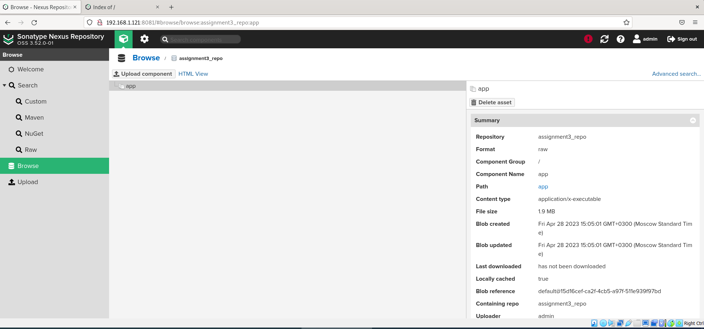

# Домашнее задание к занятию "`Что такое DevOps. СI/СD`" - `Митяев Григорий`

### Задание 1

1. Установим **Jenkins** и **Java Runtime Environment**.
2. Инсталлируем **Go** на виртуальную машину с **Jenkins**.
3. Сделал форк репозитория - [SDVPS-Materials](https://github.com/mityaevg/sdvps-materials.git) к себе в **Github**.
4. Создал `Freestyle Project` в **Jenkins** - **assignment1** и произвел запуск `go test .` и `docker build .`.

```
curl -fsSL https://pkg.jenkins.io/debian-stable/jenkins.io-2023.key | sudo tee /usr/share/keyrings/jenkins-keyring.asc > /dev/null
echo deb [signed-by=/usr/share/keyrings/jenkins-keyring.asc] https://pkg.jenkins.io/debian-stable binary/ | sudo tee /etc/apt/sources.list.d/jenkins.list > /dev/null
sudo apt update
sudo apt install jenkins
sudo apt update
sudo apt install openjdk-11-jre
sudo systemctl enable jenkins
sudo systemctl start jenkins
sudo systemctl status jenkins
wget https://go.dev/dl/go1.20.3.linux-amd64.tar.gz
sudo rm -rf /usr/local/go
sudo tar -C /usr/local -xzf go1.20.3.linux-amd64.tar.gz
export PATH=$PATH:/usr/local/go/bin
source $HOME/.profile
go version
sudo cat /var/lib/jenkins/secrets/initialAdminPassword
sudo usermod -aG docker jenkins
sudo systemctl restart jenkins.service
```
<kbd></kbd>

<kbd></kbd>

<kbd></kbd>

<kbd></kbd>

<kbd></kbd>

<kbd></kbd>

<kbd></kbd>

<kbd></kbd>

<kbd></kbd>

<kbd></kbd>

<kbd></kbd>

<kbd></kbd>

---

### Задание 2

1. Создал новый проект `Pipeline`в **Jenkins**.
2. Переписал сборку из **assignment1** в виде кода:
```
pipeline {
 agent any
 stages {
  stage('Git') {
   steps {git 'https://github.com/mityaevg/sdvps-materials.git'}
  }
  stage('Test') {
   steps {
    sh '/usr/local/go/bin/go test .'
   }
  }
  stage('Build') {
   steps {
    sh 'docker build . -t ubuntu-bionic:8082/hello-world:v$BUILD_NUMBER'
   }
  }
 }
}
```
Скриншоты с настройками **assignment2** и результатами выполнения сборки:

<kbd></kbd>

<kbd></kbd>

<kbd></kbd>

---

### Задание 3

1. Установим **Nexus** на виртуальную машину.
2. Cоздал `raw (hosted)` репозиторий **assignment3_repo** в **Nexus**.
3. Изменил пайплайн, чтобы собирался бинарный **go-file**:
```
stage('Build') {
   steps {
    sh 'CGO_ENABLED=0 GOOS=linux /usr/local/go/bin/go build -a -installsuffix cgo -o ~/app .'
   }
  }
```
4. Добавил в пайплайн этап для загрузки бинарного файла в мой репозиторий **Nexus** на ВМ - **192.168.1.121**:
```
stage('Push') {
   steps {
    sh 'curl -u "admin:Convatec10102" http://192.168.1.121:8081/repository/assignment3_repo/ --upload-file ~/app'
   }
  }
```
Настройки проекта **assignment3** и результаты выполнения сборки:

<kbd></kbd>

<kbd></kbd>

<kbd></kbd>

<kbd></kbd>

<kbd></kbd>

<kbd></kbd>

<kbd></kbd>
